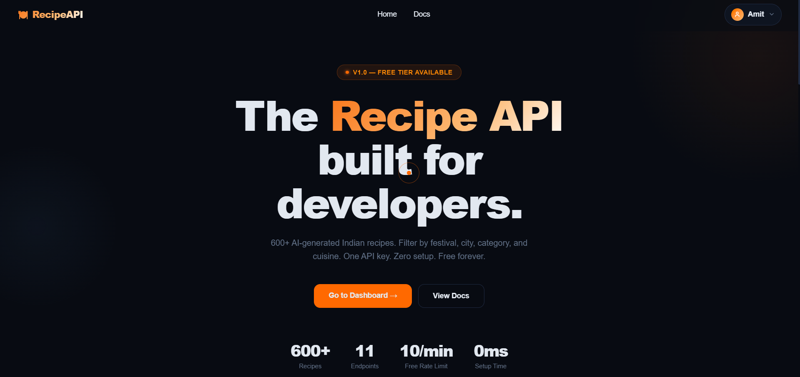
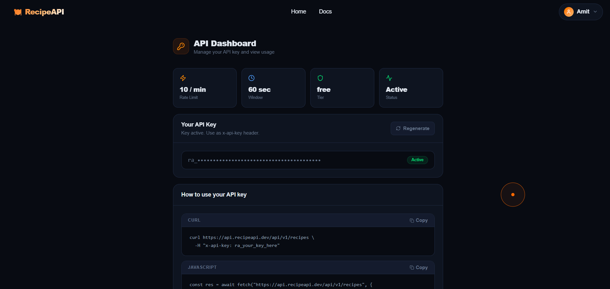
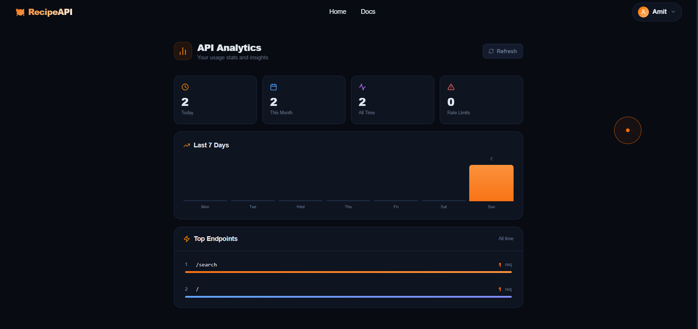
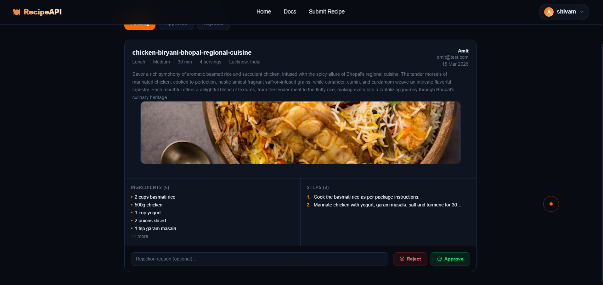
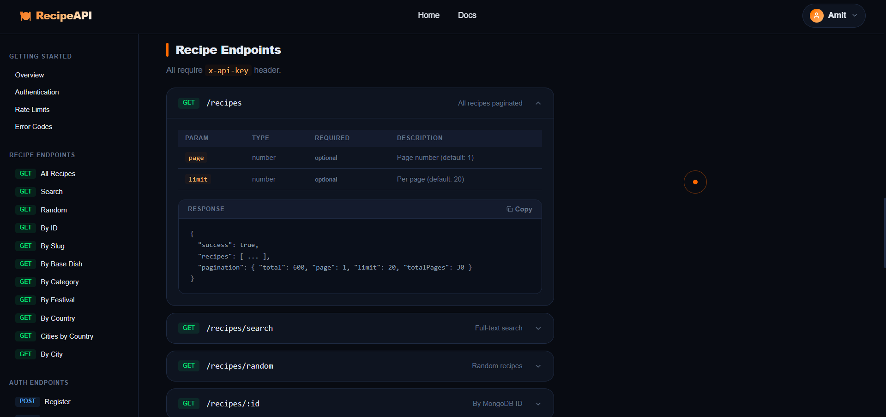

# 🍽️ RecipeAPI — REST API Platform for Indian Recipes

A production-grade REST API platform built for developers. 600+ AI-generated Indian recipes with full authentication, API key management, analytics, rate limiting, and a community recipe submission system.

**Live Demo:** [recipeapi.dev](https://recipeapi.dev) &nbsp;|&nbsp;  **API Docs:** [app.recipeapi.dev/docs](https://app.recipeapi.dev/docs)

---
## 📸 Screenshots

> Home Page · API Dashboard · Analytics · Admin Dashboard · Docs

### 🏠 Home Page


### 📊 API Dashboard


### 📈 API Analytics


### 🛠 Admin Dashboard



### 📄 DOCS


---

## 🚀 Features

### Authentication
- Register / Login with JWT access + refresh token rotation
- Tokens stored in **httpOnly cookies** — never exposed to frontend JS
- Refresh tokens hashed with **bcrypt** before storing in DB
- Auto token refresh on expiry
- Secure logout — clears tokens from DB and cookies

### API Key System
- API keys generated using `crypto` — format: `ra_<48 hex chars>`
- Keys hashed with **SHA-256** before storing in DB
- Raw key shown **only once** on creation — never retrievable again
- Regenerate key anytime from dashboard
- All recipe endpoints require `x-api-key` header

### Rate Limiting
- Per-API-key sliding window rate limiter
- Free tier: **10 requests per 60 seconds**
- Returns standard headers: `X-RateLimit-Limit`, `X-RateLimit-Remaining`, `X-RateLimit-Reset`
- Returns `429 Too Many Requests` when exceeded

### Caching
- In-memory caching with **node-cache** (5 min TTL)
- Cached: all recipes, search, category, festival, country, city, slug, ID
- Not cached: random recipes (intentionally fresh every time)

### Analytics
- Every API request logged to MongoDB
- Dashboard shows: requests today, this month, all time, rate limit hits
- Top endpoints with request counts and visual bar chart
- 7-day daily trend chart

### Community Recipes (v2)
- Users can submit their own recipes via API
- Submissions require registered RecipeAPI account email
- Rate limited to **2 submissions per 60 seconds**
- Manual admin review workflow (approve / reject with note)
- Submitter can track status: pending / approved / rejected

### Admin Dashboard
- Email-based admin role (set via environment variable)
- Review queue with recipe preview (ingredients, steps, image)
- Approve or reject with optional rejection note
- Image click-to-preview popup
- Protected route — non-admins redirected to home

---

## 🛠️ Tech Stack

| Layer | Technology |
|-------|-----------|
| Runtime | Node.js |
| Framework | Express.js |
| Database | MongoDB + Mongoose |
| Authentication | JWT (access + refresh tokens) |
| Password Hashing | bcryptjs |
| Caching | node-cache |
| File Uploads | multer (configured) |
| Logging | morgan |
| Frontend | React 18 + Vite |
| Styling | Tailwind CSS v4 |
| Icons | lucide-react |
| Routing | react-router-dom v6 |
| Deployment (API) | Render |
| Deployment (App) | Vercel |

---

## 📁 Project Structure

### Backend
```
recipeapi-backend/
├── src/
│   ├── config/
│   │   └── db.js                     # MongoDB connection
│   ├── models/
│   │   ├── recipe.model.js           # Recipe schema (600+ recipes)
│   │   ├── user.model.js             # User schema with apiKey, refreshToken
│   │   ├── userRecipe.model.js       # Community recipe submissions
│   │   └── analytics.model.js        # API request logs
│   ├── services/
│   │   ├── recipe.service.js         # DB queries + node-cache
│   │   ├── auth.service.js           # Register, login, tokens, API keys
│   │   ├── userRecipe.service.js     # Submit, approve, reject recipes
│   │   └── analytics.service.js      # Usage stats aggregation
│   ├── controllers/
│   │   ├── recipe.controller.js      # Recipe request handlers
│   │   ├── auth.controller.js        # Auth request handlers
│   │   ├── userRecipe.controller.js  # Community recipe handlers
│   │   └── analytics.controller.js  # Analytics handlers
│   ├── routes/
│   │   ├── recipe.routes.js          # /api/v1/recipes
│   │   ├── auth.routes.js            # /api/v1/auth
│   │   ├── userRecipe.routes.js      # /api/v2/user-recipe
│   │   └── analytics.routes.js       # /api/v1/analytics
│   ├── middlewares/
│   │   ├── auth.middleware.js        # protect (JWT) + validateApiKey (SHA-256)
│   │   ├── rateLimiter.middleware.js # Sliding window rate limiter
│   │   ├── userRecipeRateLimit.middleware.js  # 2 submissions/min
│   │   └── isAdmin.middleware.js     # Email-based admin check
│   ├── utils/
│   │   ├── generateTokens.js         # JWT access + refresh token gen
│   │   ├── generateApiKey.js         # crypto raw + SHA-256 hashed key
│   │   └── setCookies.js             # httpOnly cookie helpers
│   ├── app.js                        # Express app setup, middlewares, routes
│   └── server.js                     # DB connect + listen
├── .env.example
├── package.json
└── README.md
```

### Frontend
```
recipeapi-frontend/
├── src/
│   ├── context/
│   │   └── AuthContext.jsx           # Global auth state + all API calls
│   ├── components/
│   │   ├── Navbar.jsx                # Sticky nav, Login/Signup or UserDropdown
│   │   ├── UserDropdown.jsx          # Avatar menu, admin-aware
│   │   ├── Footer.jsx                # Links, status indicator
│   │   └── CursorBubble.jsx         # Custom cursor with delayed bubble
│   ├── pages/
│   │   ├── Home.jsx                  # Hero, code example, endpoints, features
│   │   ├── Docs.jsx                  # Full API reference (v1 + v2)
│   │   ├── Login.jsx                 # Login form
│   │   ├── Signup.jsx                # Register with password strength meter
│   │   ├── ApiDashboard.jsx          # API key management
│   │   ├── Analytics.jsx             # Usage stats, charts
│   │   ├── Profile.jsx               # Account info, delete account
│   │   ├── SubmitRecipe.jsx          # Community recipe form
│   │   ├── MyRecipes.jsx             # Submission history with status
│   │   └── AdminDashboard.jsx        # Admin review queue
│   ├── App.jsx                       # Routes + AdminRoute guard
│   ├── main.jsx                      # React entry point
│   └── index.css                     # Tailwind v4 + custom utilities
├── index.html
├── vite.config.js
├── .env.example
└── package.json
```

---

## 🔌 API Endpoints

### Base URL
```
https://api.recipeapi.dev/api/v1
```

### Auth — `/api/v1/auth`
| Method | Endpoint | Description | Auth |
|--------|----------|-------------|------|
| POST | `/register` | Create account | — |
| POST | `/login` | Login | — |
| POST | `/refresh` | Rotate tokens via cookie | — |
| POST | `/logout` | Clear tokens | Cookie |
| GET | `/me` | Get current user | Cookie |
| POST | `/create-api-key` | Generate API key (shown once) | Cookie |
| POST | `/regenerate-key` | Replace API key | Cookie |
| DELETE | `/delete-account` | Delete account permanently | Cookie |

### Recipes — `/api/v1/recipes`
| Method | Endpoint | Description |
|--------|----------|-------------|
| GET | `/` | All recipes (paginated) |
| GET | `/search?q=` | Full-text search |
| GET | `/random?count=` | Random recipes |
| GET | `/:id` | Recipe by MongoDB ID |
| GET | `/slug/:slug` | Recipe by slug |
| GET | `/base/:dish` | All variants of a base dish |
| GET | `/category/:category` | Filter by category |
| GET | `/festival/:festival` | Filter by festival |
| GET | `/country/:country` | Filter by country |
| GET | `/country/:country/cities` | All cities in a country |
| GET | `/country/:country/city?q=` | Filter by city |

> All recipe endpoints require `x-api-key` header

### Analytics — `/api/v1/analytics`
| Method | Endpoint | Description | Auth |
|--------|----------|-------------|------|
| GET | `/` | Get usage stats | Cookie |

### User Recipes — `/api/v2/user-recipe`
| Method | Endpoint | Description | Auth |
|--------|----------|-------------|------|
| GET | `/` | All approved community recipes | API Key |
| POST | `/` | Submit a recipe | API Key |
| GET | `/my` | My submitted recipes | Cookie |
| GET | `/admin` | All recipes (admin) | Cookie + Admin |
| PATCH | `/admin/:id/approve` | Approve recipe | Cookie + Admin |
| PATCH | `/admin/:id/reject` | Reject with note | Cookie + Admin |

---

## ⚙️ Environment Variables

### Backend `.env`
```env
PORT=8000
MONGO_URI=your_mongodb_connection_string
JWT_ACCESS_SECRET=your_access_secret
JWT_REFRESH_SECRET=your_refresh_secret
NODE_ENV=development
ADMIN_EMAILS=youremail@gmail.com
```

### Frontend `.env`
```env
VITE_API_URL=http://localhost:8000/api/v1
VITE_ADMIN_EMAIL=youremail@gmail.com
```

---

## 🏃 Running Locally

### Backend
```bash
git clone https://github.com/yourusername/recipeapi-backend
cd recipeapi-backend
npm install
cp .env.example .env
# Fill in your .env values
npm run dev
```

### Frontend
```bash
git clone https://github.com/yourusername/recipeapi-frontend
cd recipeapi-frontend
npm install
cp .env.example .env
# Fill in your .env values
npm run dev
```

---

## 🔒 Security Highlights

- Passwords hashed with **bcrypt** (salt rounds: 10)
- Refresh tokens hashed with **bcrypt** before DB storage
- API keys hashed with **SHA-256** — fast lookup, secure storage
- Access tokens expire in **15 minutes**
- Refresh tokens expire in **7 days** with rotation on every use
- All tokens stored in **httpOnly, sameSite cookies** — XSS safe
- CORS configured with `credentials: true` for specific origin only
- Admin access restricted by email via environment variable

---

## 📊 Data

- **600+ recipes** AI-generated, covering Indian cuisine
- **9 categories:** Breakfast, Lunch, Dinner, Snack, Street Food, Dessert, Festival, Healthy, Lunch/Dinner
- **8 festivals:** Diwali, Holi, Eid, Navratri, Christmas, Ramadan, Pongal, Baisakhi
- Fields: title, slug, baseDish, ingredients, steps, cookingTime, servings, difficulty, tags, image, city, country, cuisine

---

## 👨‍💻 Author

Built by **[AMIT RAJ]** — [GitHub](https://github.com/kramit624) · [LinkedIn](https://linkedin.com/in/amit-raj-101204m)

---
